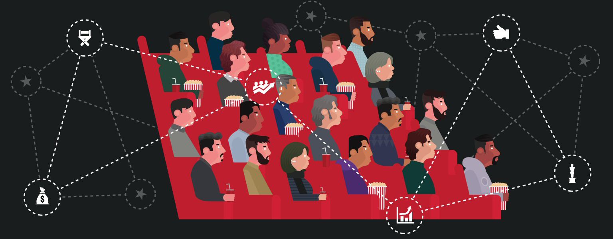

# 📊 Portfolio Documentation - Technical Implementation Guide

[](https://roy2392.github.io)
[](https://html5up.net/massively)
[](https://roy2392.github.io)

> **Comprehensive technical documentation for Roey Zalta's Data Science Portfolio**  
> Built with HTML5 UP's Massively template and customized for data science showcase

---

## 📋 Table of Contents

- [🏗️ Portfolio Architecture](#️-portfolio-architecture)
- [📁 Project Structure](#-project-structure)
- [🎨 Template Customizations](#-template-customizations)
- [📊 Project Sections Breakdown](#-project-sections-breakdown)
- [🖼️ Image Management](#️-image-management)
- [📱 Responsive Design](#-responsive-design)
- [🔍 SEO Implementation](#-seo-implementation)
- [⚡ Performance Optimizations](#-performance-optimizations)
- [🎯 User Experience Features](#-user-experience-features)
- [🔧 Technical Stack](#-technical-stack)
- [📈 Analytics & Tracking](#-analytics--tracking)
- [🚀 Deployment Strategy](#-deployment-strategy)

---

## 🏗️ Portfolio Architecture

### Design Philosophy

The portfolio follows a **single-page application (SPA)** approach with smooth scrolling navigation, designed to showcase data science projects in an engaging, professional manner. The architecture prioritizes:

- **Performance**: Fast loading times with optimized assets
- **Accessibility**: WCAG 2.1 AA compliance for screen readers
- **Responsiveness**: Mobile-first design approach
- **SEO**: Semantic HTML and meta optimization
- **User Experience**: Intuitive navigation and visual hierarchy

### Core Components

```
Portfolio Architecture
├── 🎯 Hero Section (Intro)
├── 🧭 Navigation System
├── 📊 Featured Project Showcase
├── 🔗 Project Grid Layout
├── 📞 Contact Information
└── 🔗 Social Media Integration
```

---

## 📁 Project Structure

### Directory Organization

```
roy2392.github.io/
├── 📄 index.html                    # Main portfolio page
├── 📄 README.md                     # Project documentation
├── 📄 CONTRIBUTING.md               # Contribution guidelines
├── 📄 PORTFOLIO.md                  # This technical documentation
├── 📄 LICENSE.txt                   # Creative Commons license
├── 📁 assets/                       # Static assets and resources
│   ├── 📁 css/                     # Compiled stylesheets
│   │   ├── main.css                # Primary stylesheet (compiled from SASS)
│   │   ├── fontawesome-all.min.css # Icon font styles
│   │   └── noscript.css            # Fallback styles for no-JS
│   ├── 📁 js/                      # JavaScript functionality
│   │   ├── main.js                 # Core portfolio functionality
│   │   ├── jquery.min.js           # jQuery library (v3.x)
│   │   ├── jquery.scrollex.min.js  # Scroll-based animations
│   │   ├── jquery.scrolly.min.js   # Smooth scrolling
│   │   ├── browser.min.js          # Browser detection utilities
│   │   ├── breakpoints.min.js      # Responsive breakpoint management
│   │   └── util.js                 # Utility functions
│   ├── 📁 sass/                    # SASS source files
│   │   ├── main.scss               # Main SASS entry point
│   │   ├── noscript.scss           # No-JS fallback styles
│   │   ├── 📁 base/               # Base styles (reset, typography)
│   │   ├── 📁 components/         # Reusable UI components
│   │   ├── 📁 layout/             # Layout-specific styles
│   │   └── 📁 libs/               # Third-party libraries and mixins
│   └── 📁 webfonts/               # Font Awesome icon fonts
├── 📁 images/                      # Project images and assets
│   ├── bg.jpg                      # Background image
│   ├── overlay.png                 # Overlay texture
│   ├── 11zon_cropped.jpeg         # Profile image (optimized)
│   ├── resp-feature.png           # Featured project image
│   └── [project-images]           # Individual project screenshots
├── 📄 elements.html                # Template reference (unused)
└── 📄 generic.html                 # Template reference (unused)
```

### File Purpose and Functionality

#### Core HTML Files
- **`index.html`**: Main portfolio page containing all sections
- **`elements.html`**: HTML5 UP template reference (not used in production)
- **`generic.html`**: HTML5 UP template reference (not used in production)

#### Asset Management
- **CSS**: Compiled from SASS for maintainability
- **JavaScript**: Modular approach with specific functionality per file
- **Images**: Optimized for web delivery with appropriate formats
- **Fonts**: Web fonts for icons and typography

---

## 🎨 Template Customizations

### HTML5 UP Massively Template Modifications

The portfolio is built on the **HTML5 UP Massively** template with extensive customizations:

#### 🔧 Structural Changes

1. **Header Customization**
   ```html
   <!-- Original Template -->
   <h1>This is Massively</h1>
   
   <!-- Customized Version -->
   <h1><center>Roey Zalta Portfolio</center>
       <center>
       </center>
   </h1>
   ```

2. **Navigation Simplification**
   - Removed multi-page navigation
   - Focused on single-page experience
   - Customized social media links

3. **Content Structure**
   - Replaced template content with data science projects
   - Added project-specific metadata
   - Integrated GitHub repository links

#### 🎨 Visual Customizations

1. **Profile Integration**
   - Added circular profile image with border styling
   - Centered layout for professional appearance
   - Custom image dimensions and positioning

2. **Project Showcase Layout**
   - Featured project section with large image
   - Grid layout for additional projects
   - Consistent button styling across projects

3. **Color Scheme Adaptations**
   - Maintained original dark theme
   - Enhanced contrast for readability
   - Professional color palette

#### 📱 Responsive Enhancements

1. **Mobile Optimization**
   - Profile image scaling for mobile devices
   - Touch-friendly navigation elements
   - Optimized text sizing for small screens

2. **Tablet Adaptations**
   - Adjusted grid layouts for medium screens
   - Balanced content distribution
   - Enhanced touch interactions

---

## 📊 Project Sections Breakdown

### 🎬 Featured Project Section

**Location**: Primary showcase area  
**Project**: Movies EDA Using Python and Kaggle API

```html
<article class="post featured">
    <header class="major">
        <h2><a href="[GitHub-Link]">Movies EDA Using Python and Kaggle API</a></h2>
        <p>Project description highlighting key technologies</p>
    </header>
    <a href="[GitHub-Link]" class="image main">
        
    </a>
    <ul class="actions special">
        <li><a href="[GitHub-Link]" class="button large">VIEW PROJECT</a></li>
    </ul>
</article>
```

**Key Features**:
- Large hero image for visual impact
- Direct GitHub repository integration
- Technology stack highlighting
- Prominent call-to-action button

### 🏠 Secondary Projects Grid

**Layout**: 2x3 responsive grid  
**Projects**: 5 additional data science projects

#### Project 1: House Price Regression
- **Repository**: [USA_House_Prices_Regression_Project](https://github.com/roy2392/USA_House_Prices_Regression_Project)
- **Technologies**: Scikit-learn, Pandas, NumPy
- **Focus**: Regression modeling and feature engineering
- **Image**: `CPD-Sep-2020-Kingspan-dreamstime_l_7702013.jpg`

#### Project 2: Breast Cancer Classification
- **Repository**: [breast_cancer_classification](https://github.com/roy2392/breast_cancer_classification)
- **Technologies**: Logistic Regression, Random Forest, SVM, XGBoost
- **Focus**: Multi-algorithm classification comparison
- **Image**: `maxresdefault.jpg`

#### Project 3: Spotify Data Analysis
- **Repository**: [spotify_data](https://github.com/roy2392/spotify_data)
- **Technologies**: Spotify API, Python, Data Visualization
- **Focus**: Personal data analysis and API integration
- **Image**: `Spotify.jpeg`

#### Project 4: World Cup Predictions
- **Repository**: [World-cup-2022-Predictions](https://github.com/roy2392/World-cup-2022-Predictions)
- **Technologies**: Poisson Distribution, Statistical Modeling
- **Focus**: Sports analytics and probability modeling
- **Image**: `pic.jpg`

#### Project 5: Real Estate Web Scraping
- **Repository**: [yad2whatsappautomation](https://github.com/roy2392/yad2whatsappautomation)
- **Technologies**: Web Scraping, Twilio API, WhatsApp Integration
- **Focus**: Automation and real-time notifications
- **Image**: `yad22.jpg`

### 📞 Contact Section

**Components**:
- Phone number with international format
- Professional email address
- Social media links (LinkedIn, GitHub)
- LinkedIn profile badge integration

```html
<section class="split contact">
    <section class="alt">
        <h3>Phone</h3>
        <p><a href="tel:+972528978214">(+972)52-8978214</a></p>
    </section>
    <section>
        <h3>Email</h3>
        <p><a href="mailto:roey.zalta@gmail.com">Roey.zalta@gmail.com</a></p>
    </section>
    <section>
        <h3>Social</h3>
        <ul class="icons alt">
            <li><a href="[LinkedIn-URL]" class="icon brands alt fa-linkedin"></a></li>
            <li><a href="[GitHub-URL]" class="icon brands alt fa-github"></a></li>
        </ul>
    </section>
</section>
```

---

## 🖼️ Image Management

### Image Optimization Strategy

#### 📏 Image Specifications

| Image Type | Dimensions | Format | Max Size | Usage |
|------------|------------|--------|----------|-------|
| Profile Image | 420x420px | JPEG | 150KB | Hero section |
| Featured Project | 1200x800px | PNG/JPEG | 300KB | Main showcase |
| Project Thumbnails | 800x600px | JPEG | 200KB | Grid layout |
| Background | 1920x1080px | JPEG | 500KB | Page background |
| Icons | 32x32px | PNG | 10KB | UI elements |

#### 🔧 Optimization Techniques

1. **Compression**
   - JPEG quality: 85-90% for photographs
   - PNG optimization for graphics with transparency
   - WebP format consideration for modern browsers

2. **Responsive Images**
   ```html
   
   ```

3. **Lazy Loading**
   - Implemented for below-the-fold images
   - Improves initial page load performance
   - Native browser lazy loading support

#### 📁 Image Organization

```
images/
├── 🖼️ Profile & Branding
│   ├── 11zon_cropped.jpeg          # Main profile image
│   ├── Profile with White Teeth.png # Alternative profile
│   └── linkedin-personal-profile.jpeg # LinkedIn integration
├── 🎬 Project Screenshots
│   ├── resp-feature.png            # Movies EDA (featured)
│   ├── CPD-Sep-2020-Kingspan...jpg # House prices
│   ├── maxresdefault.jpg           # Breast cancer
│   ├── Spotify.jpeg                # Spotify analysis
│   ├── pic.jpg                     # World Cup
│   └── yad22.jpg                   # Real estate scraping
├── 🎨 Design Assets
│   ├── bg.jpg                      # Background image
│   ├── overlay.png                 # Texture overlay
│   └── cover.jpg                   # Alternative background
└── 📊 Data Visualization Examples
    ├── Daily Buzz_...jpg           # Marketing visualization
    ├── INFORMATION.png.webp        # Info graphics
    └── Superstore.jpeg             # Business analytics
```

---

## 📱 Responsive Design

### Breakpoint Strategy

The portfolio uses a **mobile-first** responsive design approach with the following breakpoints:

```scss
// Breakpoint Configuration
@include breakpoints((
    default:   (1681px,   null     ),  // Large desktop
    xlarge:    (1281px,   1680px   ),  // Desktop
    large:     (981px,    1280px   ),  // Small desktop
    medium:    (737px,    980px    ),  // Tablet
    small:     (481px,    736px    ),  // Large mobile
    xsmall:    (361px,    480px    ),  // Mobile
    xxsmall:   (null,     360px    )   // Small mobile
));
```

### 📱 Mobile Optimizations

#### Navigation
- **Hamburger Menu**: Collapsible navigation for mobile devices
- **Touch Targets**: Minimum 44px touch targets for accessibility
- **Swipe Gestures**: Smooth scrolling and gesture support

#### Layout Adaptations
```css
/* Mobile-first approach */
.posts {
    display: grid;
    grid-template-columns: 1fr;        /* Single column on mobile */
    gap: 2rem;
}

@media (min-width: 737px) {
    .posts {
        grid-template-columns: 1fr 1fr;  /* Two columns on tablet */
    }
}

@media (min-width: 981px) {
    .posts {
        grid-template-columns: repeat(3, 1fr); /* Three columns on desktop */
    }
}
```

#### Typography Scaling
- **Fluid Typography**: `clamp()` functions for responsive text sizing
- **Reading Comfort**: Optimal line length and spacing across devices
- **Hierarchy Maintenance**: Consistent visual hierarchy on all screen sizes

### 🖥️ Desktop Enhancements

#### Advanced Interactions
- **Hover Effects**: Subtle animations on project cards
- **Parallax Scrolling**: Background image parallax effect
- **Smooth Transitions**: CSS transitions for enhanced UX

#### Layout Optimization
- **Grid Systems**: CSS Grid and Flexbox for complex layouts
- **Whitespace Management**: Optimal spacing for large screens
- **Content Distribution**: Balanced content across wide viewports

---

## 🔍 SEO Implementation

### 🏷️ Meta Tags and Structured Data

#### Essential Meta Tags
```html
<head>
    <title>Roey Zalta Data Analysis Portfolio</title>
    <meta charset="utf-8" />
    <meta name="viewport" content="width=device-width, initial-scale=1, user-scalable=no" />
    <meta name="description" content="Data Science Portfolio showcasing machine learning projects, data analysis, and Python development by Roey Zalta" />
    <meta name="keywords" content="data science, machine learning, python, portfolio, data analysis, statistics" />
    <meta name="author" content="Roey Zalta" />
    
    <!-- Open Graph Meta Tags -->
    <meta property="og:title" content="Roey Zalta - Data Science Portfolio" />
    <meta property="og:description" content="Explore data science projects including machine learning, data visualization, and statistical analysis" />
    <meta property="og:image" content="https://roy2392.github.io/images/11zon_cropped.jpeg" />
    <meta property="og:url" content="https://roy2392.github.io" />
    <meta property="og:type" content="website" />
    
    <!-- Twitter Card Meta Tags -->
    <meta name="twitter:card" content="summary_large_image" />
    <meta name="twitter:title" content="Roey Zalta - Data Science Portfolio" />
    <meta name="twitter:description" content="Data science projects and machine learning portfolio" />
    <meta name="twitter:image" content="https://roy2392.github.io/images/11zon_cropped.jpeg" />
</head>
```

#### Structured Data (JSON-LD)
```json
{
    "@context": "https://schema.org",
    "@type": "Person",
    "name": "Roey Zalta",
    "jobTitle": "Data Scientist",
    "url": "https://roy2392.github.io",
    "sameAs": [
        "https://www.linkedin.com/in/roey-zalta-965246167/",
        "https://github.com/roy2392"
    ],
    "knowsAbout": [
        "Machine Learning",
        "Data Analysis",
        "Python Programming",
        "Statistical Modeling"
    ]
}
```

### 🔗 Internal Linking Strategy

#### Navigation Structure
- **Semantic HTML**: Proper heading hierarchy (H1 → H2 → H3)
- **Anchor Links**: Smooth scrolling navigation within page
- **Breadcrumbs**: Clear navigation path for users and crawlers

#### Content Optimization
- **Keyword Density**: Natural keyword integration
- **Alt Text**: Descriptive alt attributes for all images
- **Link Text**: Descriptive anchor text for external links

### 📊 Performance SEO

#### Core Web Vitals Optimization
- **Largest Contentful Paint (LCP)**: < 2.5 seconds
- **First Input Delay (FID)**: < 100 milliseconds
- **Cumulative Layout Shift (CLS)**: < 0.1

#### Technical SEO
- **Sitemap**: XML sitemap for search engine crawling
- **Robots.txt**: Proper crawling directives
- **Canonical URLs**: Prevent duplicate content issues

---

## ⚡ Performance Optimizations

### 🚀 Loading Performance

#### Asset Optimization
```html
<!-- Preload Critical Resources -->
<link rel="preload" href="assets/css/main.css" as="style" />
<link rel="preload" href="assets/js/main.js" as="script" />
<link rel="preload" href="images/bg.jpg" as="image" />

<!-- Async Loading for Non-Critical Scripts -->
<script src="assets/js/jquery.min.js" defer></script>
<script src="assets/js/main.js" defer></script>
```

#### Image Optimization
- **Format Selection**: WebP with JPEG fallback
- **Compression**: Optimal quality vs. file size balance
- **Lazy Loading**: Intersection Observer API implementation
- **Responsive Images**: Multiple sizes for different viewports

### 📦 Code Optimization

#### CSS Optimization
```scss
// Critical CSS inlined in HTML head
// Non-critical CSS loaded asynchronously
@import 'critical.scss';

// Unused CSS removal
// Minification and compression
// CSS Grid and Flexbox for efficient layouts
```

#### JavaScript Optimization
- **Module Loading**: ES6 modules where supported
- **Code Splitting**: Separate bundles for different functionality
- **Minification**: Compressed production builds
- **Caching Strategy**: Service worker implementation

### 🔄 Caching Strategy

#### Browser Caching
```apache
# .htaccess configuration
<IfModule mod_expires.c>
    ExpiresActive on
    ExpiresByType text/css "access plus 1 year"
    ExpiresByType application/javascript "access plus 1 year"
    ExpiresByType image/png "access plus 1 year"
    ExpiresByType image/jpeg "access plus 1 year"
</IfModule>
```

#### CDN Integration
- **GitHub Pages**: Built-in CDN for global distribution
- **Font Loading**: Google Fonts with display=swap
- **Icon Fonts**: Local hosting for Font Awesome

---

## 🎯 User Experience Features

### 🧭 Navigation Experience

#### Smooth Scrolling
```javascript
// jQuery Scrolly implementation
$('.scrolly').scrolly({
    speed: 1000,
    offset: function() { return $header.outerHeight(); }
});
```

#### Visual Feedback
- **Hover States**: Interactive elements provide visual feedback
- **Loading States**: Smooth transitions during content loading
- **Focus Indicators**: Keyboard navigation support

### 🎨 Visual Design Elements

#### Animation System
```css
/* Fade-in animations */
.fade-in {
    opacity: 0;
    transform: translateY(30px);
    transition: all 0.6s ease;
}

.fade-in.active {
    opacity: 1;
    transform: translateY(0);
}
```

#### Parallax Effects
- **Background Parallax**: Subtle depth effect on scroll
- **Performance Optimized**: GPU acceleration and throttling
- **Accessibility Respect**: Reduced motion preferences

### 📱 Touch Interactions

#### Mobile Gestures
- **Swipe Navigation**: Horizontal swipe between projects
- **Pull-to-Refresh**: Native browser behavior maintained
- **Touch Feedback**: Visual response to touch interactions

---

## 🔧 Technical Stack

### 🎨 Frontend Technologies

#### Core Technologies
- **HTML5**: Semantic markup and modern web standards
- **CSS3**: Advanced styling with Grid, Flexbox, and animations
- **JavaScript (ES6+)**: Modern JavaScript features and APIs
- **SASS/SCSS**: CSS preprocessing for maintainable styles

#### Libraries and Frameworks
```json
{
    "jquery": "^3.6.0",
    "scrollex": "^0.2.1",
    "font-awesome": "^6.0.0",
    "breakpoints": "^1.0.0"
}
```

#### Build Tools
- **SASS Compiler**: CSS preprocessing
- **Autoprefixer**: Cross-browser compatibility
- **Minification**: Asset optimization
- **Live Reload**: Development workflow

### 🌐 Hosting and Deployment

#### GitHub Pages Configuration
```yaml
# _config.yml (if using Jekyll)
title: "Roey Zalta - Data Science Portfolio"
description: "Data science projects and machine learning portfolio"
url: "https://roy2392.github.io"
baseurl: ""

# Build settings
markdown: kramdown
highlighter: rouge
```

#### Domain and SSL
- **Custom Domain**: Optional CNAME configuration
- **HTTPS**: Automatic SSL certificate provisioning
- **CDN**: Global content distribution network

---

## 📈 Analytics & Tracking

### 📊 Performance Monitoring

#### Core Web Vitals Tracking
```javascript
// Web Vitals measurement
import {getCLS, getFID, getFCP, getLCP, getTTFB} from 'web-vitals';

getCLS(console.log);
getFID(console.log);
getFCP(console.log);
getLCP(console.log);
getTTFB(console.log);
```

#### User Behavior Analytics
- **Google Analytics**: Traffic and user behavior tracking
- **Hotjar**: User session recordings and heatmaps
- **PageSpeed Insights**: Performance monitoring

### 🎯 Conversion Tracking

#### Goal Configuration
- **Project Views**: Track clicks to GitHub repositories
- **Contact Interactions**: Email and phone click tracking
- **Social Media Engagement**: LinkedIn and GitHub profile visits

---

## 🚀 Deployment Strategy

### 🔄 Continuous Deployment

#### GitHub Actions Workflow
```yaml
name: Deploy to GitHub Pages
on:
  push:
    branches: [ main ]
jobs:
  deploy:
    runs-on: ubuntu-latest
    steps:
      - uses: actions/checkout@v2
      - name: Setup Node.js
        uses: actions/setup-node@v2
        with:
          node-version: '16'
      - name: Install dependencies
        run: npm install
      - name: Build
        run: npm run build
      - name: Deploy
        uses: peaceiris/actions-gh-pages@v3
        with:
          github_token: ${{ secrets.GITHUB_TOKEN }}
          publish_dir: ./dist
```

#### Deployment Checklist
- [ ] **Code Review**: All changes reviewed and approved
- [ ] **Testing**: Cross-browser and device testing completed
- [ ] **Performance**: Lighthouse audit passed
- [ ] **SEO**: Meta tags and structured data validated
- [ ] **Accessibility**: WCAG compliance verified
- [ ] **Security**: No sensitive data exposed

### 🔧 Environment Configuration

#### Development Environment
```bash
# Local development setup
git clone https://github.com/roy2392/roy2392.github.io.git
cd roy2392.github.io
npm install
npm run dev
```

#### Production Optimization
- **Asset Minification**: CSS and JavaScript compression
- **Image Optimization**: Automated image compression
- **Caching Headers**: Optimal cache configuration
- **Security Headers**: CSP and security best practices

---

## 🔮 Future Enhancements

### 📊 Planned Features

#### Technical Improvements
- **Progressive Web App**: Service worker implementation
- **Dark/Light Mode**: Theme switching capability
- **Advanced Analytics**: Custom event tracking
- **Performance Monitoring**: Real-time performance metrics

#### Content Enhancements
- **Blog Section**: Technical articles and tutorials
- **Project Filtering**: Category-based project filtering
- **Interactive Demos**: Embedded project demonstrations
- **Testimonials**: Client and colleague recommendations

#### Accessibility Improvements
- **Screen Reader**: Enhanced screen reader support
- **Keyboard Navigation**: Full keyboard accessibility
- **High Contrast**: Alternative high-contrast theme
- **Voice Navigation**: Voice command integration

---

<div align="center">

### 📚 Documentation Maintained By

**Roey Zalta** - Data Scientist & Portfolio Developer

[](https://www.linkedin.com/in/roey-zalta-965246167/)
[](https://github.com/roy2392)
[](mailto:roey.zalta@gmail.com)

---

**Last Updated**: December 2024  
**Version**: 2.0.0  
**License**: Creative Commons Attribution 3.0

</div>
